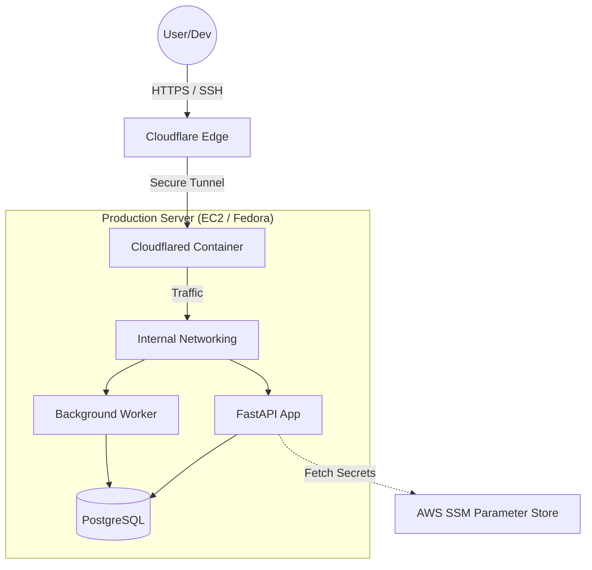

# LeadFlowAI 🚀

**Next-Gen SaaS CRM with Enterprise-Grade Security & AI Integration.**

LeadFlowAI is a secure, containerized SaaS platform designed to automate lead intake via WhatsApp, process audio using AI, and manage customer relationships. It features a **Zero-Trust architecture** and fully automated CI/CD pipelines.

## 🏗️ System Architecture

The platform runs on a hardened production environment using a **Zero Trust** model. No ports (22/80/443) are open to the public internet. All ingress traffic is routed through Cloudflare Tunnels.



## ✨ Key Features

### 🔐 Security & Infrastructure (DevSecOps)

* **Zero Trust Access:** Server is completely locked down (no open inbound ports). Access is managed via **Cloudflare Tunnels** with strict Identity Access Management (IAM).
* **Bank-Grade Secret Management:** Removed all `.env` files from production. Secrets and API keys are fetched dynamically from **AWS Systems Manager (SSM) Parameter Store** at runtime.
* **Secure Deployment:** SSH access for deployment is proxied through Cloudflare Access using Service Tokens, preventing direct network attacks.
* **Container Security:** Running on **Podman** (daemonless) for enhanced security compared to standard Docker.

### 💻 Application Capabilities

* **Multi-Tenancy SaaS:** Logic-separated user data ensuring strict isolation between tenants.
* **AI Audio Pipeline:** Asynchronous processing of voice notes using **Faster-Whisper** and LLMs for summarization.
* **Modern Auth:** Robust authentication system using JWT, Argon2 hashing, and secure cookie handling.

## 🛠️ Tech Stack

| Category | Technologies |
| --- | --- |
| **Backend** | Python 3.11, FastAPI, SQLAlchemy (Async), Pydantic |
| **Database** | PostgreSQL 15 (Relational Data), Alembic (Migrations) |
| **DevOps** | GitHub Actions, GHCR (Container Registry), Podman |
| **Cloud & Net** | AWS (SSM, SDK), Cloudflare Zero Trust (Tunnels, Access) |
| **Server** | Fedora Linux (EC2) |

## 🔄 Automated CI/CD Pipeline

The project utilizes a sophisticated **GitHub Actions** workflow for "Click-to-Deploy" functionality:

1. **Build & Test:** On `git push`, the code is linted and built into a Docker/OCI image.
2. **Registry Push:** The image is tagged (SHA + Latest) and pushed to **GitHub Container Registry (GHCR)**.
3. **Secure Tunneling:** The Action installs `cloudflared`, authenticates via a Service Token, and opens a secure SSH tunnel to the production server.
4. **Zero-Config Deploy:** The server pulls the new image and restarts the containers. Secrets are injected directly from AWS during startup.

## 🚀 Getting Started (Local Dev)

### Prerequisites

* **Podman** or Docker Desktop.
* **Python 3.11+**.
* **AWS CLI** (Optional, for SSM simulation).

### Installation

1. **Clone the repository:**
```bash
git clone https://github.com/shay-mordechai/leadflow-ai.git
cd leadflow-ai

```


2. **Run with Compose:**
```bash
# This will spin up the DB and the Web App
podman-compose up -d --build

```


3. **Access the App:**
* Dashboard: `http://localhost:8000`
* API Docs: `http://localhost:8000/docs`


## 👤 Author

**Shay Mordechai**

* **Full-Stack Developer & Cloud Architect.**
* Specializing in building secure, scalable SaaS platforms combining modern Python web frameworks with enterprise-grade DevOps practices (AWS, Cloudflare, CI/CD).

---

*Built with ❤️, Python, and a lot of coffee.*